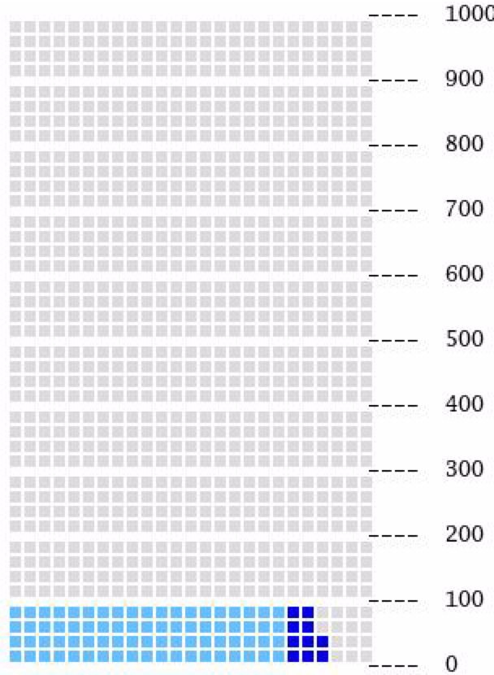
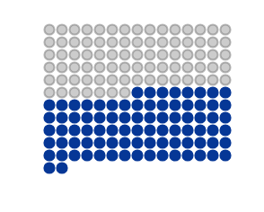
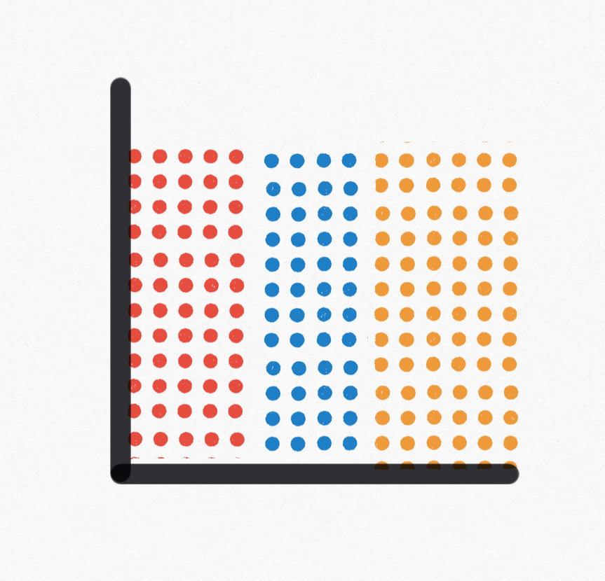
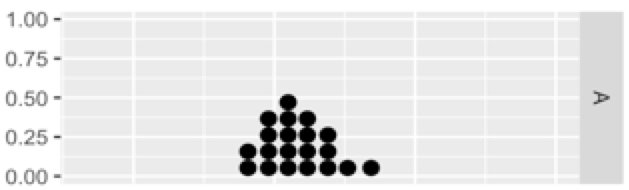
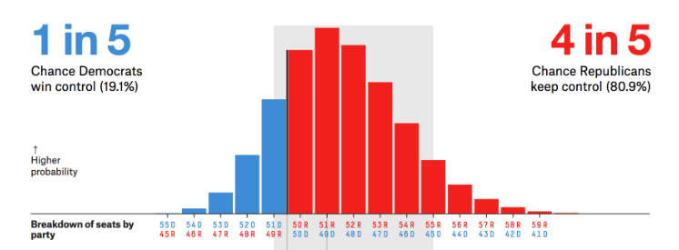
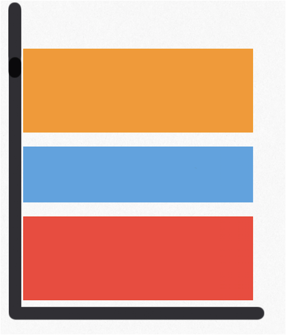
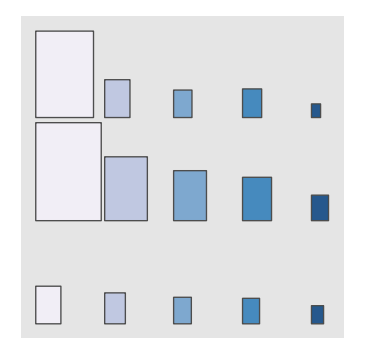

https://docs.google.com/spreadsheets/d/1pPdn9oyV1YQ7Pc8O-2elcSSoiXiFNY_1IFBeqELyHGM/edit?usp=sharing

| Geometry            | Aesthetics mapping                      | Visualization name	| Picture  	|
|--------------------	|--------------------------------------------	|------------	|---	|
| geom_icon          	| width = P(A);                              	| icon array 	| |
| geom_icon          	| height = P(B);                             	|icon array (coord flip) 	|  |
| geom_icon          	| x = A;                                     	| N/A        	|   	|
| geom_icon          	| y = B;                                     	|            	|   	|
| geom_icon          	| width = P(A); height = P(B);               	|            	|     |
| geom_icon          	| width = P(A); x = A;                       	|            	|   | 
| geom_icon          	| width = P(A); y = B;                       	|            	|   	|
| geom_icon          	| height = P(B); x = A;                      	|            	|   	|
| geom_icon          	| height = P(B); y = B;                      	|      dot plot      	|   |
| geom_icon          	| x = A; y = B;                              	|            	|   	|
| geom_icon          	| width = P(A); height = P(B); x = A;        	|            	|   	|
| geom_icon          	| width = P(A); height = P(B); y = B;        	|            	|   	|
| geom_icon          	| width = P(A); x = A; y = B;                	|            	|   	|
| geom_icon          	| height = P(B); x = A; y = B;               	|            	|   	|
| geom_icon          	| width = P(A); height = P(B); x = A; y = B; 	|            	|   	|
| geom_block         	| width = P(A);                              	|            	|   	|
| geom_block         	| height = P(B);                             	|            	|   	|
| geom_block         	| x = A;                                     	|            	|   	|
| geom_block         	| y = B;                                     	|            	|   	|
| geom_block         	| width = P(A); height = P(B);               	|            	|   	|
| geom_block         	| width = P(A); x = A;                       	|            	|   |
| geom_block         	| width = P(A); y = B;                       	|            	|   |
| geom_block         	| height = P(B); x = A;                      	|            	|     |
| geom_block         	| height = P(B); y = B;                      	|            	|   |
| geom_block         	| x = A; y = B;                              	|            	|   	|
| geom_block         	| width = P(A); height = P(B); x = A;        	|            	|   	|
| geom_block         	| width = P(A); height = P(B); y = B;        	|            	|   	|
| geom_block         	| width = P(A); x = A; y = B;                	|            	|   	|
| geom_block         	| height = P(B); x = A; y = B;               	|            	|   	|
| geom_block         	| width = P(A); height = P(B); x = A; y = B; 	|            	|   	|
